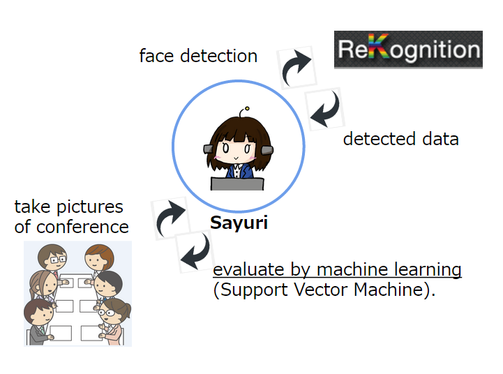

sayuri-server
=============

Sayuri evaluates good or bad of your conference by machine learning.

## Architecture



* Use web camera to take pictures of conference scene.
* Detect faces in the picture by [Rekognition API](https://rekognition.com/).
* Evaluate good or bad of conference by machine learning (SVM).

more detail is described below.

[machine learning for conference consulting system](http://www.slideshare.net/takahirokubo7792/ss-47094972)

## Dependencies

* Python 3.4.3
* Tornado
* Redis
* scikit-learn

You can read how to create the model by ipython notebook (at [`sayuri/machine/evaluator/create_evaluator`](https://github.com/icoxfog417/sayuri-server/blob/master/sayuri/machine/evaluator/create_evaluator.ipynb)).
To read this document, you have to install below.

* ipython notebook
* matplotlib


## Installation

### Run on your Heroku

You can use Heroku Button. 

[](https://heroku.com/deploy)

Sayuri uses Rekognition API, so you have to create account and set configuration variables. 

### Run on your Local

You have to create Rekognition account too. And then create `envs.json` at the root of the project like below.

```
{
  "SECRET_KEY": "__YOUR_SECRET_KEY__",
  "REDIS_URL": "redis://localhost:6379",
  "FACE_API_KEY": "your_key",
  "FACE_API_SECRET": "your_secret_key",
  "FACE_API_NAMESPACE": "namespace",
  "FACE_API_USER_ID": "user_id"
}
```

And You have to create a certificate to use SSL. Because Sayuri use `wss` protocol for security issue.

Create `ssl` folder at the root of the project and make `serverkey.pem` and `servercrt.pem`.

For example.

```
openssl genrsa -out serverkey.pem 2048
openssl req -new -key serverkey.pem -out server.csr
openssl x509 -req -in server.csr -signkey serverkey.pem -out servercrt.pem
```
